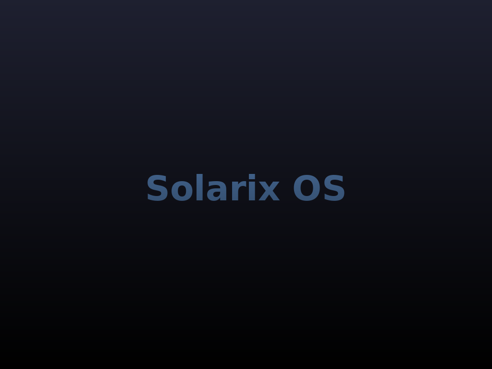

Solarix Operating System
=========================

Solarix is a lightweight 32-bit graphical operating system built from scratch.  
It features a custom kernel, boots via GRUB, and initializes a VESA framebuffer  
to draw a simple GUI environment with windowing and basic terminal interaction.

---

### 🔧 Key Features:
- Custom kernel written in **C** and **x86 Assembly**
- **Multiboot-compliant** bootloader (GRUB compatible)
- VESA-compatible GUI (1024x768 @ 32-bit color)
- Framebuffer graphics: window rendering, color fills, static wallpaper
- Simple terminal with built-in commands (`help`, `clear`, `about`)
- Auto-login as root (temporary development behavior)
- Keyboard input via direct scan code reading (PS/2)

---

### ⚙️ Requirements:
- **i686-elf** cross-compiler toolchain
- **GRUB 2** and `grub-mkrescue` for ISO image generation
- **QEMU**, VirtualBox, or any x86 virtual machine for testing
- x86 real or emulated CPU with VESA BIOS Extensions (VBE)

---

### 📦 Build Outputs:
- **Boot ISO:** `solarix.iso`
- **Kernel ELF:** `kernel.elf`
- **Project Directory:** `/solarix`

---

### 👨‍💻 Authors:
- **brainz**
- **Drexxy**

Created: **July 2025**  
Version: **1.0.1 GUI Alpha**

> 📅 Official release expected **before the end of summer break 2025**

---

### 🌄 Preview

Here's a preview of the current Solarix standard wallpaper and logo:

